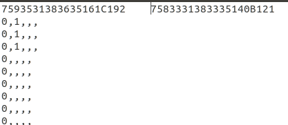

# Multi Serial Port Read

## Overview
This repository is about interfacing multiple Arduino to the serial port, read them simultaneously, and writing the data into a file. It makes use of the python `pyserial` library to find the available serial ports and read data from them. After reading data from the ports, it is written into a text file. This repository automatically determines the unique ID related to each Arduino and make sure to write the data into the corresponding columns in case one or more Arduinos are unplugged during the operation. That means, it also handles the automatic permissions of the ports. At the moment, it can handle up to four Arduino simultaneously but with a minor tweak, it can be used to read data from an arbitrary number of Arduino or any other type of serial device.  

I have tested it with two Arduino, one is Uno and the other is Mega 2560 having unique IDs of `7593531383635161C192` and `7583331383335140B121` respectively. I put these IDs as column names of the file and put the corresponding data in respective columns. The script keeps the particular row empty of a specific column if one or two serial devices (Arduinos) are unplugged and only stores the data of available devices. A screenshot of the saved file is shown below.  


## Installation and Testing
### Step 0
This is a python script written and tested using python 3.6 and Ubuntu18 but it should be compatible with any version of python3. So, make sure to test it with Ubuntu with python3 installed and configured in it.  

### Step 1
Install the `pyserial` package using the below command.  
```
pip3 install pyserial 
```

### Step 2
Copy the `my_rules.rules` file into the `/etc/udev/rules.d` directory to permanently open the ACM ports for Arduino otherwise permission has to be given every time the user unplug and plug in the device.
```
sudo cp my_rules.rules /etc/udev/rules.d
```

### Step 3
This step is necessary to find the IDs of the devices and setting up the header of the log file. Otherwise, the code would not be able to write the serial data into the corresponding columns.  
For this step, attach all the available Arduinos (maximum four) and run the `setup.py` script using the below command in the terminal (assuming you are already in the root directory of the repository).
```
python3 setup.py
```

### Step 4
After completing all the above steps (hopefully, everything is set up), the main script can be called by running the following command.
```
python3 main.py
```


## Results and Limitations
The result of the script is the logged file saved in the root directory with the name of `data_log.txt`. This file gets appended with the new data. If you wish to save data in a new file instead of appending into it then this file can be moved/saved somewhere else and the data will automatically be logged into a new file with the same name.  
After testing it for some time, I realized that when a device is unplugged and plugged in then the data of that device is not logged for a few seconds. This might be because of the restart time of Arduino and the time of occupying the port and sending data into it. 


